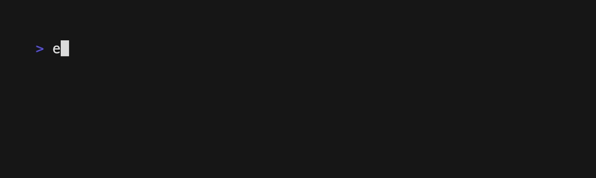

# 赤錆（あかさび）

Akasabi (rust) is a command line English/Japanese dictionary. It's heavily inspired by [myougiden](https://github.com/melissaboiko/myougiden) (but only the output format is lifted directly from it).

It works by parsing the EDICT dictionary file, and creating a searchable index with [tantivy](https://github.com/quickwit-oss/tantivy) that allows searching by meaning, reading, or kanji.

## Usage

### Installing

tbd

### Creating the index

To create the index, run `akasabi index --path <path to JMdict_e.xml>`. You can use `--index` to specify the path to the index, which currently defaults to `./tmp` in the current directory.

### Searching

Once the index is created, you can search it with `akasabi search <query>`. The query can be a word, a reading, or a meaning. The search is case-insensitive[^1], and will return all matches that contain the query. You can also specify `--field <field>` to search only a specific field (meaning, reading, or kanji).

[^1]: TODO: Verify that this is actually the case.

## License

Licensed under either of

- Apache License, Version 2.0
  ([LICENSE-APACHE](LICENSE-APACHE) or http://www.apache.org/licenses/LICENSE-2.0)
- MIT license
  ([LICENSE-MIT](LICENSE-MIT) or http://opensource.org/licenses/MIT)

at your option.

In addition, testdata/JMdict_e_test.gz is a small subset of JMdict_e.xml, which is licensed under the [Creative Commons Attribution-ShareAlike Licence (V4.0)](http://www.edrdg.org/edrdg/licence.html).

## Contribution

Unless you explicitly state otherwise, any contribution intentionally submitted
for inclusion in the work by you, as defined in the Apache-2.0 license, shall be
dual licensed as above, without any additional terms or conditions.
